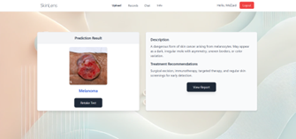
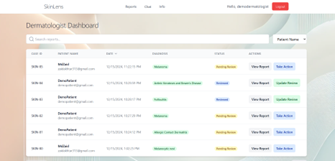

# 🧠 SkinLens

SkinLens is an AI-powered web platform for skin disease detection and dermatological reporting. It enables users to upload images, receive predictions using a deep learning model, and manage cases through separate dashboards for patients and dermatologists.

---

## 🚀 Features

- 📷 **Image Upload**: Submit skin condition images for analysis  
- 🧠 **AI Diagnosis**: Predict skin diseases using a trained model  
- 👤 **Patient Dashboard**: Review past diagnoses and results  
- 🩺 **Dermatologist Dashboard**: Manage and review patient cases  
- 📄 **Report Generator**: Download PDF or view results online
- 💬 **Chat Interface**: Interactive support and education  

---

## 🩻 Classification Categories

SkinLens is trained to recognize the following 21 skin conditions:

|                             |                             |                             |
|-----------------------------|-----------------------------|-----------------------------|
| Acne                        | Basal cell carcinoma        | Lupus erythematosus         |
| Actinic keratoses & Bowen's | Benign keratosis-like lesions | Melanocytic nevi          |
| Allergic contact dermatitis | Eczema                      | Melanoma                    |
| Folliculitis                | Lichen planus               | Neutrophilic dermatoses     |
| Photodermatoses             | Pityriasis rosea            | Pityriasis rubra pilaris    |
| Psoriasis                   | Sarcoidosis                 | Scabies                     |
| Scleroderma                 | Squamous cell carcinoma     | Urticaria                   |

---

## 🗂️ Project Structure

```
SkinLens/
├── frontend/             # React-based frontend
│   └── src/
│       └── pages/        # UploadPage, ResultPage, etc.
├── flask-server/         # Flask API backend
│   └── app.py            # Main prediction endpoint
├── models/               # Keras model files
├── docs/
│   └── screenshots/      # UI screenshots for README
├── README.md             # Project description and usage
└── .gitignore
```

---

## 🛠️ Getting Started

### ⚙️ Backend Setup (Flask + TensorFlow)

```bash
cd flask-server
pip install -r requirements.txt
python app.py
```

> Make sure Python 3.8+ and TensorFlow are installed.

### 💻 Frontend Setup (React)

```bash
cd frontend
npm install
npm start
```

> Runs at `http://localhost:3000`

---

## 📡 API Usage Example

**Endpoint:** `POST /predict`

**Request JSON:**
```json
{
  "imageUrl": "https://example.com/image.jpg"
}
```

**Response JSON:**
```json
{
  "prediction": "Melanoma"
}
```

---

## 🧬 Model Info

- Format: `.keras` model  
- Input size: `224x224x3`  
- Output: 21-class softmax prediction  
- Trained using image folders labeled by condition name

---

## 📄 License

This project is for educational/research purposes only.  
Based on original work from [`htmw/2024F-Biased`](https://github.com/htmw/2024F-Biased) under MIT license.

---

## 🙌 Credits

Developed and maintained by [Sorafune/SkinLens](https://github.com/Sorafune/SkinLens).  
Uses open-source tools: React, Flask, TensorFlow, and more.

---

## 🖼️ User Interface Preview

| Home Page | SignUp Page | LogIn Page |
|-----------|-------------|------------|
|  |  |  |

| Upload Image Page | Prediction for Guest Users | For Authenticated Users |
|-------------------|-----------------------------|--------------------------|
|  |  |  |

| Report Before Review | Patient Past Records | List of Available Dermatologists |
|----------------------|----------------------|----------------------------------|
|  |  |  |

| Real-Time Chat | Dermatologist Dashboard | Chat with Patients |
|----------------|-------------------------|---------------------|
|  |  |  |

| Add Dermatologist Comment | Report with Comment | *(Empty)* |
|---------------------------|---------------------|-----------|
|  |  | |
      